# itelect2-project
My IT Elective 2 backend web development project.

This project was started on July 1, 2026.

## GT9 Authentication & Database Screenshots

### Authentication Endpoints

* **POST /api/auth/register (201 Created)**
  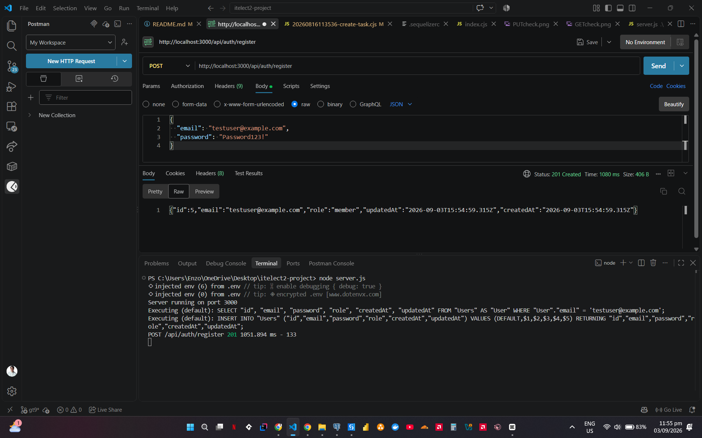

* **POST /api/auth/login (200 OK - Token Issued)**
  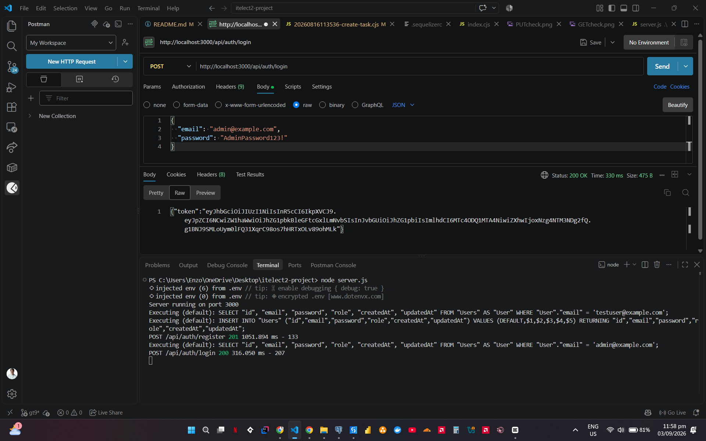

* **POST /api/auth/login (401 Unauthorized - Invalid Credentials)**
  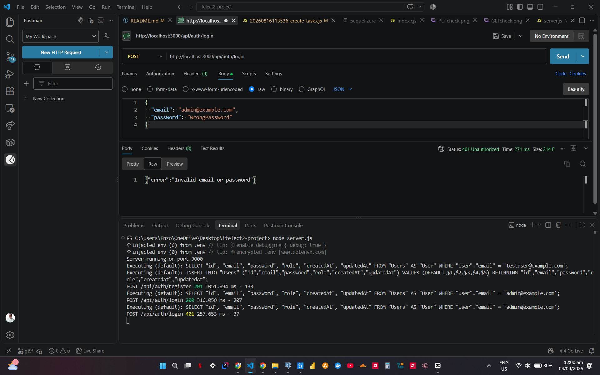

---

### Security & Token Verification

* **JWT Verification & Signature Check (jwt.io)**
  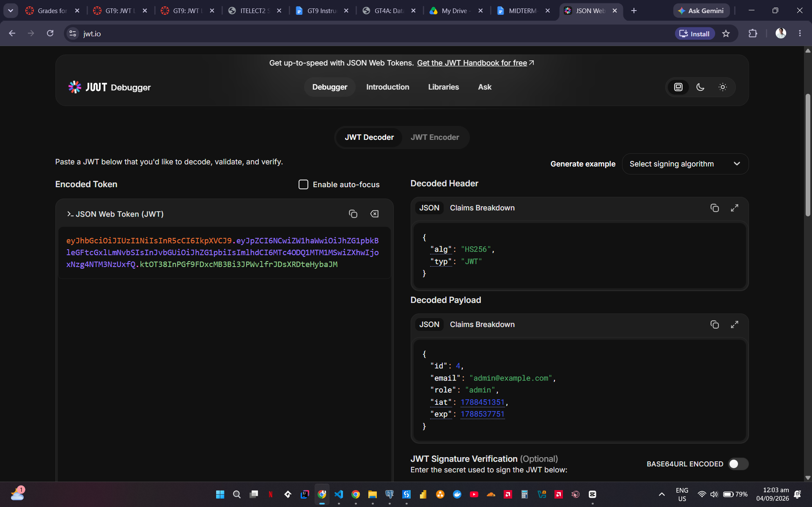

---

### Database Screenshots (Hashed Passwords)

* **pgAdmin Users Table**
  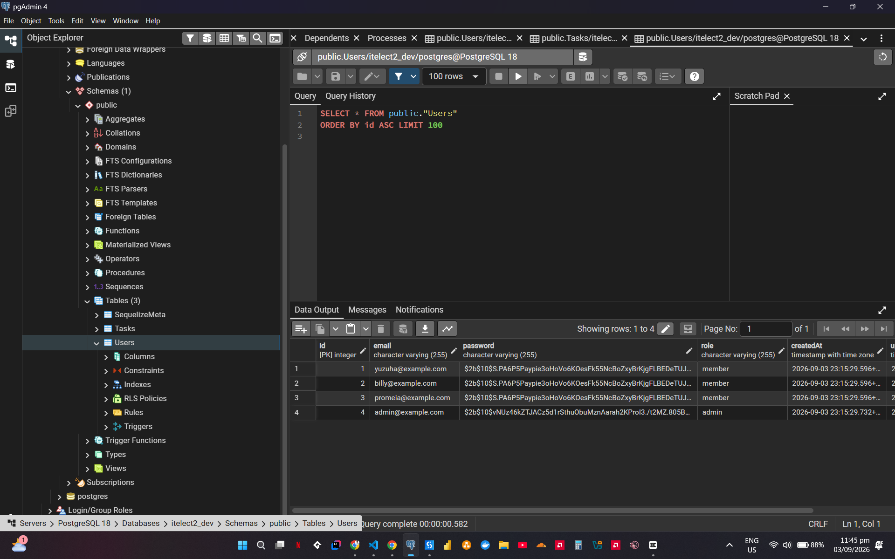
    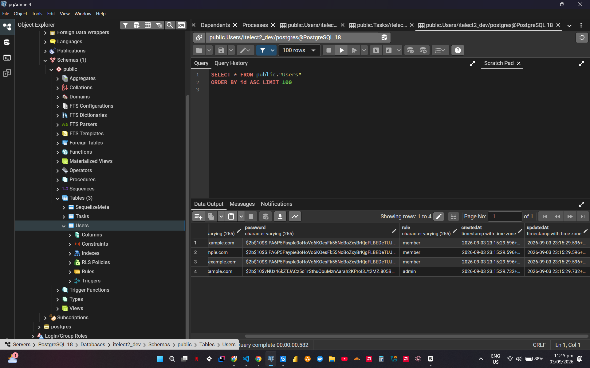

---

## GT8 Postman & Database Screenshots

### GET 
* **GET /api/users (200 OK)**
  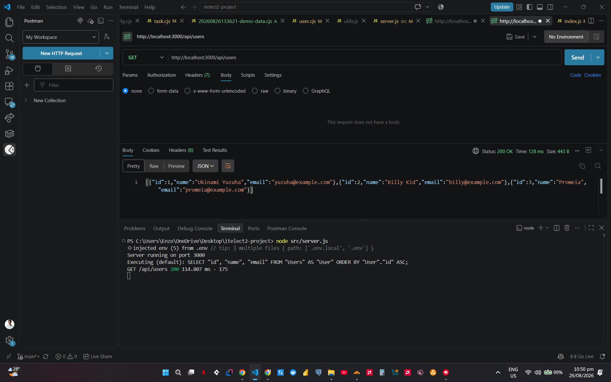

* **GET /api/tasks with (200 OK)**
  

* **GET /api/tasks/999 (404 Not Found)**
  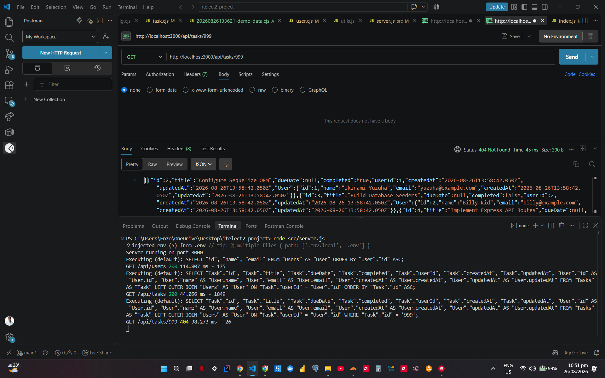

* **GET /api/tasks/6**
  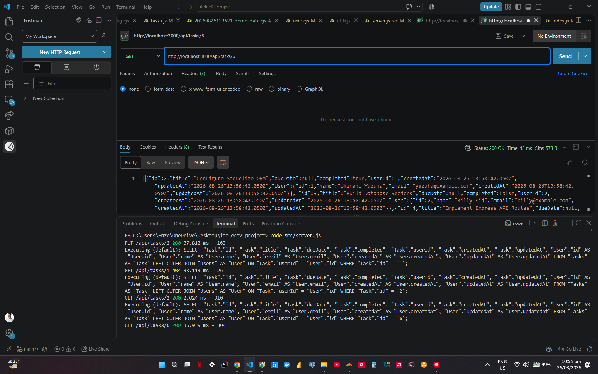

---

### POST 
* **POST /api/tasks (201 Created)**
  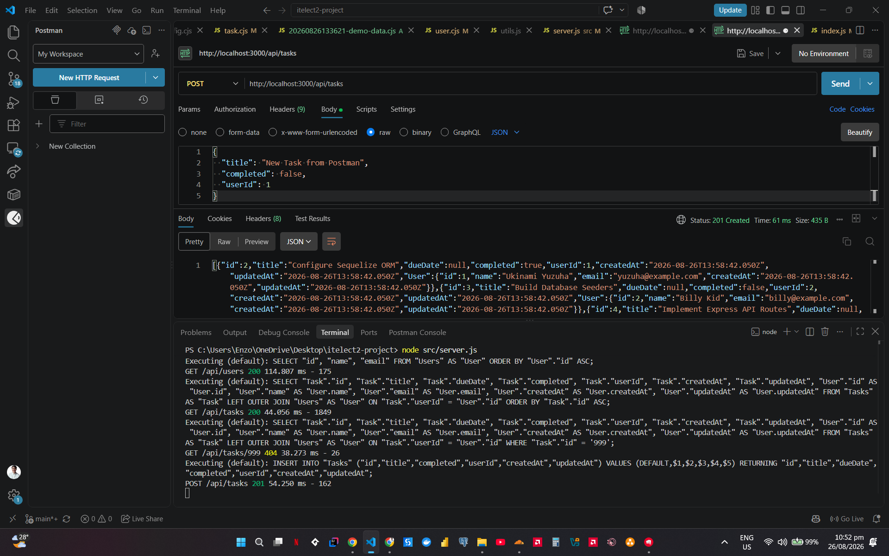

---

### PUT 

* **PUT /api/tasks/2 (200 OK)**
  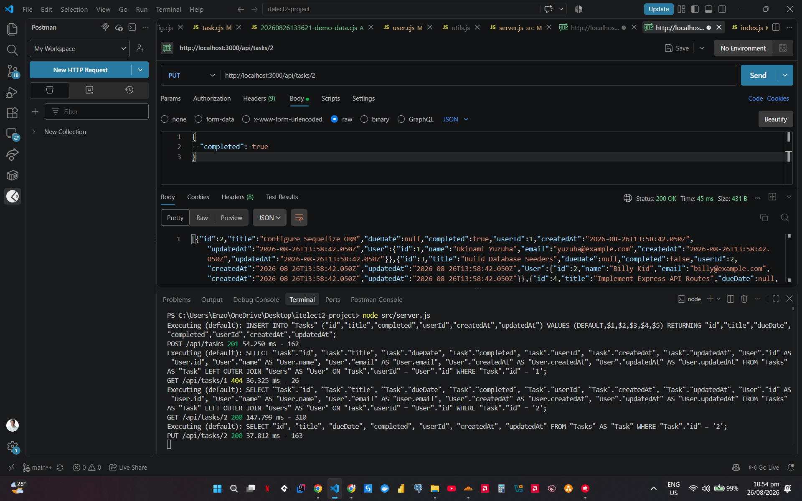

---

### DELETE 
* **DELETE /api/tasks/6 (200 OK)**
  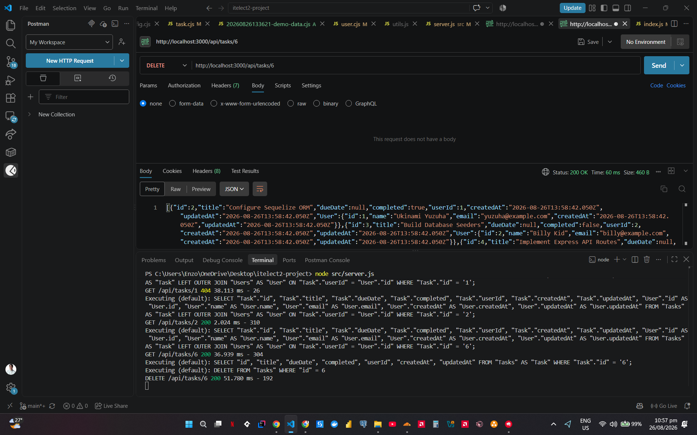

---

### Database Screenshots (Users & Tasks)
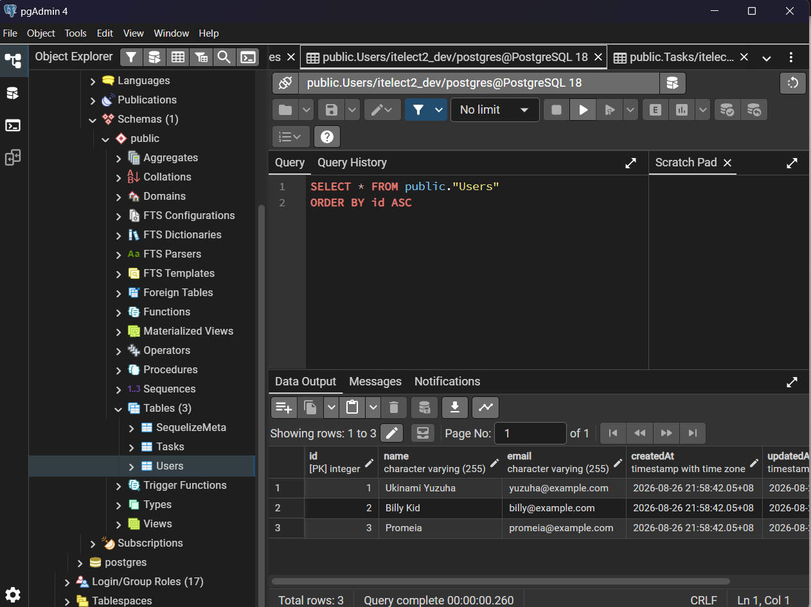
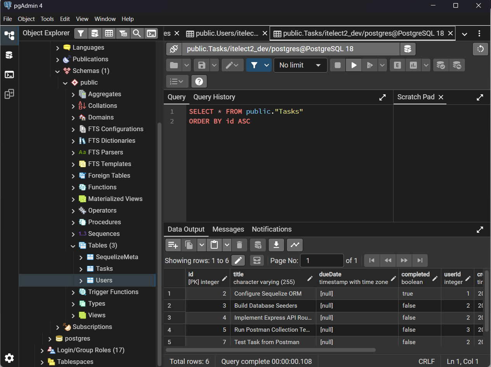