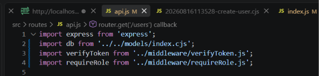
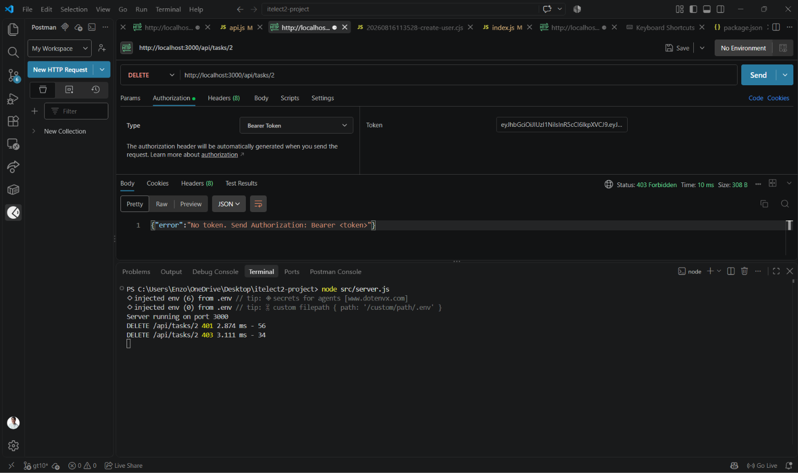
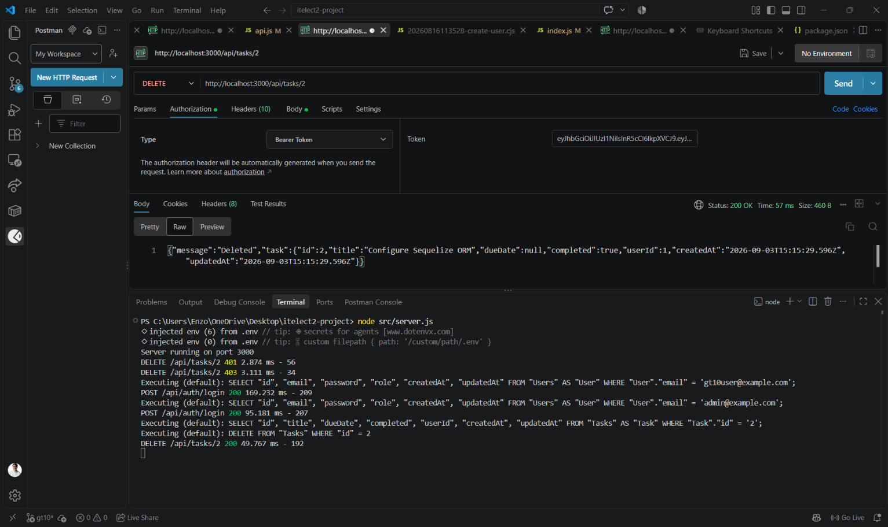
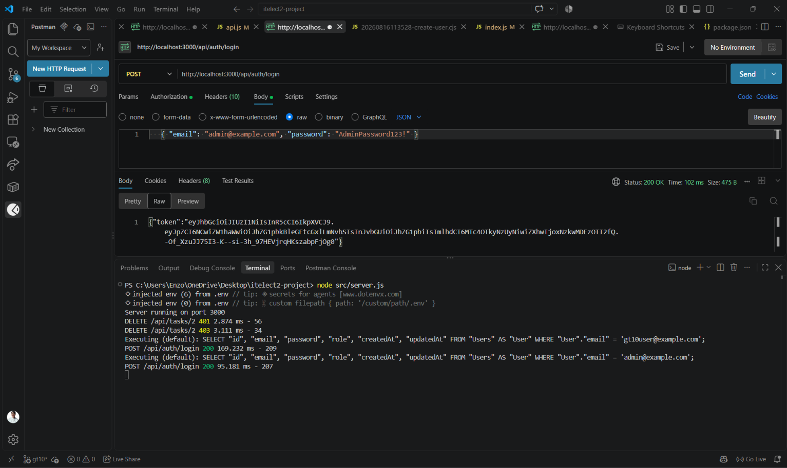

## GT10 Role-Based Authorization Screenshots

### Middleware & Route Protection

* **verifyToken on POST, PUT and DELETE, requireRole('admin') on DELETE (api.js)**
  

---

### Postman Tests (DELETE /api/tasks/:id)

* **No token (401 Unauthorized)**
  

* **Regular user's token (403 Forbidden)**
  

* **Admin token (200 OK)**
  

* **Admin login (200 OK - Token Issued)**
  

---