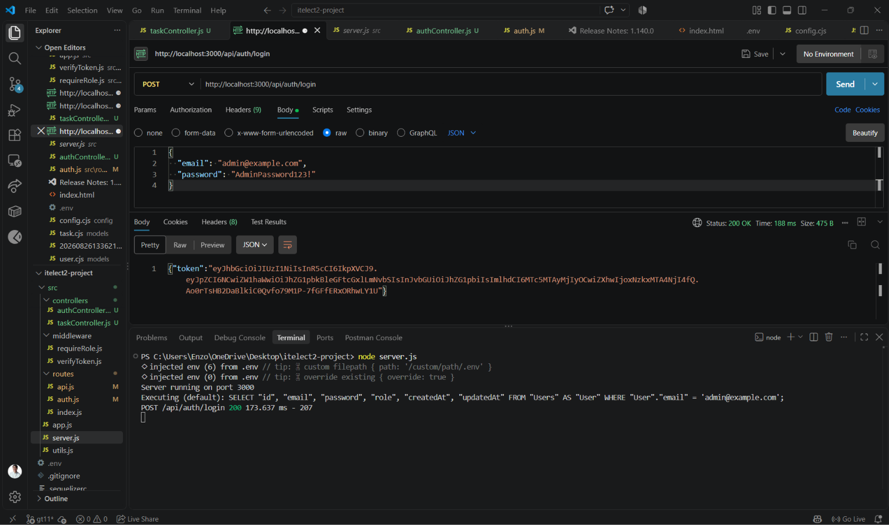
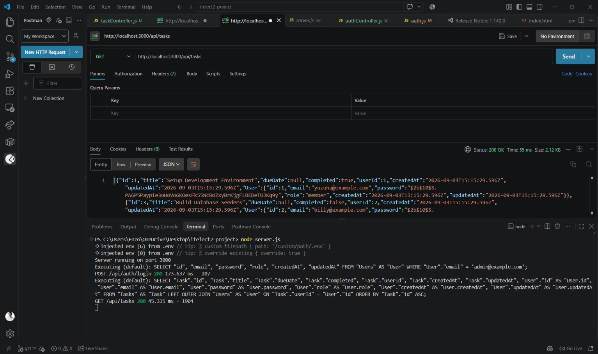
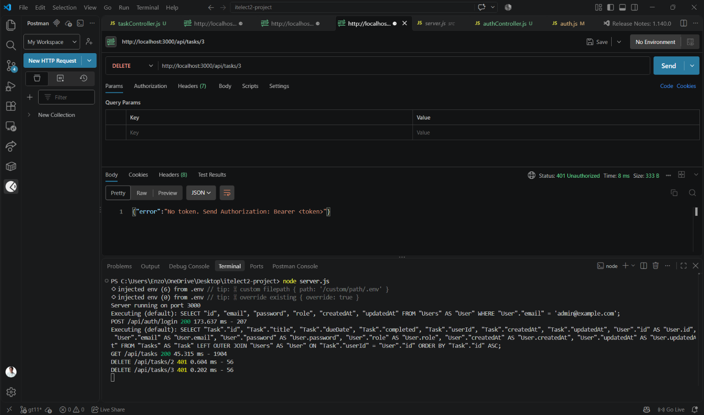
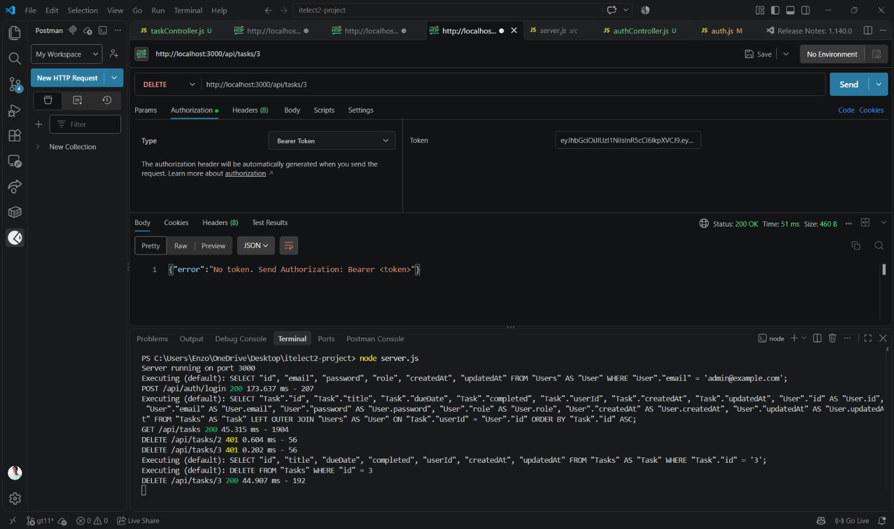
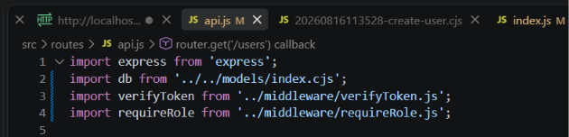
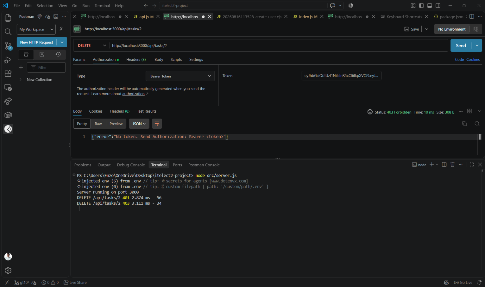
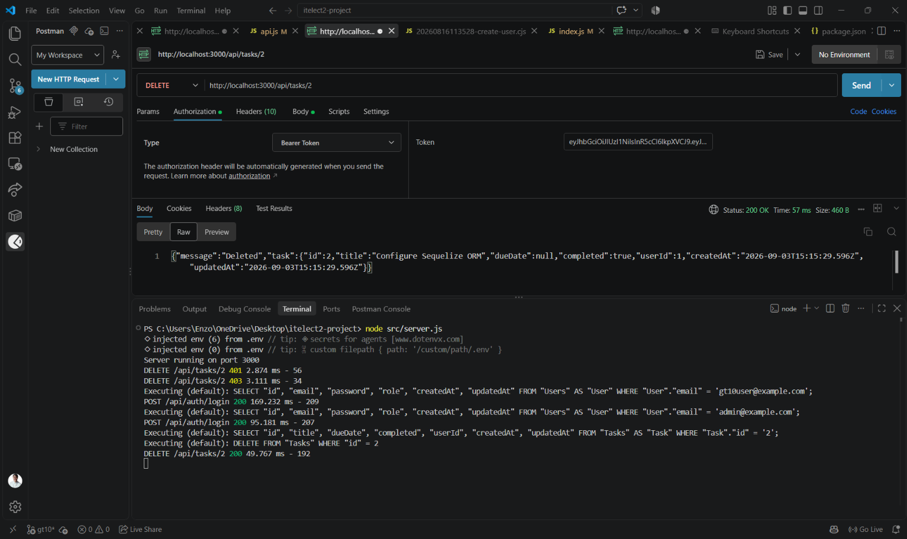
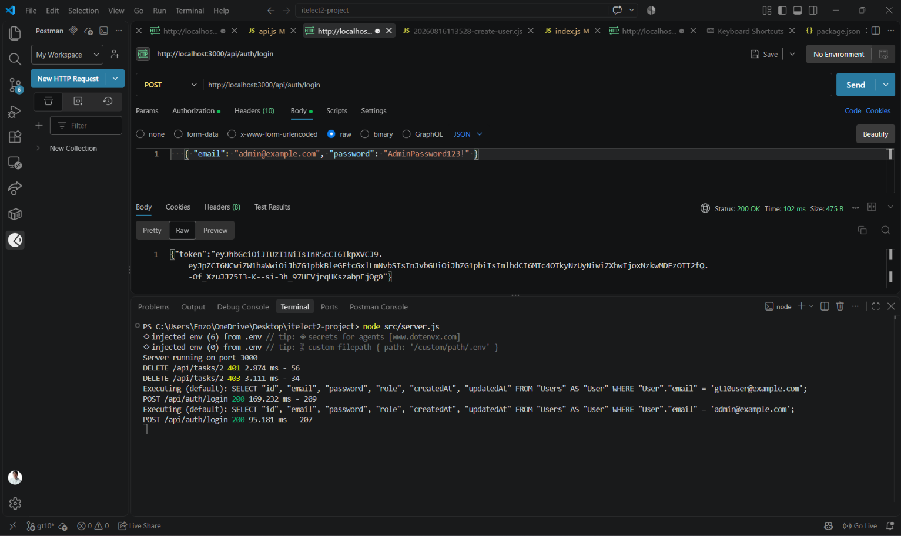

## GT11 MVC Architecture Refactoring Screenshots

### Postman Tests

* **Auth Controller - Admin Login (200 OK & JWT Issued)**
  

* **Task Controller - Get All Tasks (200 OK)**
  

* **Middleware - DELETE Task Unauthorized without Token (401 Unauthorized)**
  

* **Middleware & Task Controller - DELETE Task with Bearer Token (200 OK)**
  

---

## GT10 Role-Based Authorization Screenshots

### Middleware & Route Protection

* **verifyToken on POST, PUT and DELETE, requireRole('admin') on DELETE (api.js)**
  

---

### Postman Tests (DELETE /api/tasks/:id)

* **Regular user's token (403 Forbidden)**
  

* **Admin token (200 OK)**
  

* **Admin login (200 OK - Token Issued)**
  

---